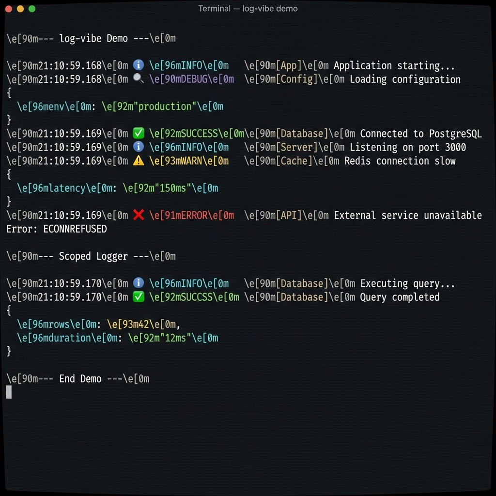

# log-vibe: Complete Development Task List

> **For Junior Developers**: Each task is designed to be self-contained and completable independently. Follow them in order for best results. Check off tasks as you complete them.

---

## Phase 0: Project Setup & Foundation
**Estimated Time: 1-2 Days**

### 0.1 Initialize the Repository

- [x] **Task 0.1.1: Create project directory**
  - Open terminal
  - Run: `mkdir log-vibe && cd log-vibe`
  - Verify: Directory exists and you're inside it

- [x] **Task 0.1.2: Initialize Git repository**
  - Run: `git init`
  - Verify: `.git` folder exists (use `ls -la` to see hidden folders)

- [x] **Task 0.1.3: Create .gitignore file**
  - Create file `.gitignore` in project root
  - Add these contents:
    ```
    node_modules/
    dist/
    coverage/
    *.log
    .DS_Store
    .env
    .env.local
    ```
  - Verify: File exists with correct contents

- [x] **Task 0.1.4: Initialize npm package**
  - Run: `npm init -y`
  - Verify: `package.json` file is created
  - Open `package.json` and verify `name` is `"log-vibe"`

- [x] **Task 0.1.5: Create MIT License file**
  - Create file `LICENSE` in project root
  - Copy MIT License text from https://opensource.org/licenses/MIT
  - Replace `[year]` with current year (2026)
  - Replace `[fullname]` with your name
  - Verify: LICENSE file exists with correct year and name

---

### 0.2 Set Up TypeScript

- [x] **Task 0.2.1: Install TypeScript as dev dependency**
  - Run: `npm install --save-dev typescript`
  - Verify: Check `package.json` has `typescript` in `devDependencies`

- [x] **Task 0.2.2: Install Node.js type definitions**
  - Run: `npm install --save-dev @types/node`
  - Verify: Check `package.json` has `@types/node` in `devDependencies`

- [x] **Task 0.2.3: Create TypeScript configuration file**
  - Create file `tsconfig.json` in project root
  - Add this configuration:
    ```json
    {
      "compilerOptions": {
        "target": "ES2020",
        "module": "ESNext",
        "moduleResolution": "bundler",
        "lib": ["ES2020"],
        "declaration": true,
        "declarationMap": true,
        "sourceMap": true,
        "strict": true,
        "noImplicitAny": true,
        "strictNullChecks": true,
        "noUnusedLocals": true,
        "noUnusedParameters": true,
        "noImplicitReturns": true,
        "esModuleInterop": true,
        "skipLibCheck": true,
        "forceConsistentCasingInFileNames": true,
        "outDir": "./dist",
        "rootDir": "./src",
        "resolveJsonModule": true
      },
      "include": ["src/**/*"],
      "exclude": ["node_modules", "dist", "test"]
    }
    ```
  - Verify: Run `npx tsc --noEmit` and ensure no errors

---

### 0.3 Set Up Build Tool (tsup)

- [x] **Task 0.3.1: Install tsup as dev dependency**
  - Run: `npm install --save-dev tsup`
  - Verify: Check `package.json` has `tsup` in `devDependencies`

- [x] **Task 0.3.2: Create tsup configuration file**
  - Create file `tsup.config.ts` in project root
  - Add this configuration:
    ```typescript
    import { defineConfig } from 'tsup';

    export default defineConfig({
      entry: ['src/index.ts'],
      format: ['cjs', 'esm'],
      dts: true,
      splitting: false,
      sourcemap: true,
      clean: true,
      minify: false,
      target: 'es2020',
    });
    ```
  - Verify: File exists with correct contents

- [x] **Task 0.3.3: Add build script to package.json**
  - Open `package.json`
  - Find the `"scripts"` section
  - Add: `"build": "tsup"`
  - Verify: Script is added correctly

---

### 0.4 Set Up Testing (Vitest)

- [x] **Task 0.4.1: Install Vitest as dev dependency**
  - Run: `npm install --save-dev vitest`
  - Verify: Check `package.json` has `vitest` in `devDependencies`

- [x] **Task 0.4.2: Create Vitest configuration file**
  - Create file `vitest.config.ts` in project root
  - Add this configuration:
    ```typescript
    import { defineConfig } from 'vitest/config';

    export default defineConfig({
      test: {
        globals: true,
        environment: 'node',
        include: ['test/**/*.test.ts'],
        coverage: {
          provider: 'v8',
          reporter: ['text', 'json', 'html'],
          include: ['src/**/*.ts'],
          exclude: ['src/**/*.d.ts'],
        },
      },
    });
    ```
  - Verify: File exists with correct contents

- [x] **Task 0.4.3: Add test scripts to package.json**
  - Open `package.json`
  - Add these to the `"scripts"` section:
    ```json
    "test": "vitest run",
    "test:watch": "vitest",
    "test:coverage": "vitest run --coverage"
    ```
  - Verify: All three scripts are added

---

### 0.5 Create Project Structure

- [x] **Task 0.5.1: Create source directory**
  - Run: `mkdir src`
  - Verify: `src` directory exists

- [x] **Task 0.5.2: Create test directory**
  - Run: `mkdir test`
  - Verify: `test` directory exists

- [x] **Task 0.5.3: Create placeholder index file**
  - Create file `src/index.ts`
  - Add placeholder content:
    ```typescript
    // log-vibe - Beautiful, simple, contextual logging
    export const VERSION = '1.0.0';
    ```
  - Verify: File exists and TypeScript compiles (`npx tsc --noEmit`)

- [x] **Task 0.5.4: Create placeholder test file**
  - Create file `test/index.test.ts`
  - Add placeholder content:
    ```typescript
    import { describe, it, expect } from 'vitest';
    import { VERSION } from '../src/index';

    describe('log-vibe', () => {
      it('should have a version number', () => {
        expect(VERSION).toBe('1.0.0');
      });
    });
    ```
  - Verify: Run `npm test` and test passes

- [x] **Task 0.5.5: Test the build process**
  - Run: `npm run build`
  - Verify: `dist` folder is created with:
    - `index.js` (CommonJS)
    - `index.mjs` (ES Module)
    - `index.d.ts` (TypeScript declarations)

---

### 0.6 Configure package.json for npm Publishing

- [x] **Task 0.6.1: Update package.json with npm metadata**
  - Open `package.json`
  - Update/add these fields:
    ```json
    {
      "name": "log-vibe",
      "version": "1.0.0",
      "description": "Beautiful, simple, contextual logging for the modern developer",
      "main": "./dist/index.js",
      "module": "./dist/index.mjs",
      "types": "./dist/index.d.ts",
      "exports": {
        ".": {
          "types": "./dist/index.d.ts",
          "import": "./dist/index.mjs",
          "require": "./dist/index.js"
        }
      },
      "files": [
        "dist"
      ],
      "keywords": [
        "logging",
        "logger",
        "console",
        "debug",
        "pretty",
        "color",
        "terminal",
        "cli",
        "node"
      ],
      "author": "Your Name <your.email@example.com>",
      "license": "MIT",
      "repository": {
        "type": "git",
        "url": "https://github.com/yourusername/log-vibe.git"
      },
      "bugs": {
        "url": "https://github.com/yourusername/log-vibe/issues"
      },
      "homepage": "https://github.com/yourusername/log-vibe#readme",
      "engines": {
        "node": ">=16.0.0"
      }
    }
    ```
  - Verify: `npm pack --dry-run` shows only the expected files

- [x] **Task 0.6.2: Verify zero production dependencies**
  - Open `package.json`
  - Ensure there is NO `"dependencies"` field (only `"devDependencies"`)
  - This is **critical** - log-vibe must have zero runtime dependencies
  - Verify: `npm ls --prod` shows no dependencies

---

### 0.7 Initial Git Commit

- [x] **Task 0.7.1: Stage all files**
  - Run: `git add .`
  - Verify: Run `git status` shows all new files staged

- [x] **Task 0.7.2: Create initial commit**
  - Run: `git commit -m "chore: initial project setup"`
  - Verify: `git log` shows the commit

---

## Phase 1: Core Library Development
**Estimated Time: 1-2 Weeks**

### 1.1 Implement Type Definitions

- [x] **Task 1.1.1: Create types file**
  - Create file `src/types.ts`
  - Add these type definitions:
    ```typescript
    /**
     * Available log levels
     */
    export type LogLevel = 'debug' | 'info' | 'success' | 'warn' | 'error';

    /**
     * A single log entry
     */
    export interface LogEntry {
      level: LogLevel;
      context: string;
      message: string;
      data?: unknown[];
      timestamp: Date;
    }

    /**
     * Logger configuration options (for future use)
     */
    export interface LoggerConfig {
      level?: LogLevel;
      showTimestamp?: boolean;
      showIcons?: boolean;
    }

    /**
     * Core logger interface
     */
    export interface Logger {
      debug(context: string, message: string, ...data: unknown[]): void;
      info(context: string, message: string, ...data: unknown[]): void;
      success(context: string, message: string, ...data: unknown[]): void;
      warn(context: string, message: string, ...data: unknown[]): void;
      error(context: string, message: string, ...data: unknown[]): void;
    }

    /**
     * Scoped logger interface (context is pre-bound)
     */
    export interface ScopedLogger {
      debug(message: string, ...data: unknown[]): void;
      info(message: string, ...data: unknown[]): void;
      success(message: string, ...data: unknown[]): void;
      warn(message: string, ...data: unknown[]): void;
      error(message: string, ...data: unknown[]): void;
    }
    ```
  - Verify: Run `npx tsc --noEmit` - no errors

---

### 1.2 Implement ANSI Color Utilities

- [x] **Task 1.2.1: Create colors utility file**
  - Create file `src/colors.ts`
  - Add color code constants:
    ```typescript
    /**
     * ANSI escape codes for terminal colors
     * These work in most modern terminals
     */

    // Reset all styles
    export const RESET = '\x1b[0m';

    // Text styles
    export const BOLD = '\x1b[1m';
    export const DIM = '\x1b[2m';

    // Foreground colors
    export const FG_BLACK = '\x1b[30m';
    export const FG_RED = '\x1b[31m';
    export const FG_GREEN = '\x1b[32m';
    export const FG_YELLOW = '\x1b[33m';
    export const FG_BLUE = '\x1b[34m';
    export const FG_MAGENTA = '\x1b[35m';
    export const FG_CYAN = '\x1b[36m';
    export const FG_WHITE = '\x1b[37m';

    // Bright foreground colors
    export const FG_BRIGHT_BLACK = '\x1b[90m';
    export const FG_BRIGHT_RED = '\x1b[91m';
    export const FG_BRIGHT_GREEN = '\x1b[92m';
    export const FG_BRIGHT_YELLOW = '\x1b[93m';
    export const FG_BRIGHT_BLUE = '\x1b[94m';
    export const FG_BRIGHT_MAGENTA = '\x1b[95m';
    export const FG_BRIGHT_CYAN = '\x1b[96m';
    export const FG_BRIGHT_WHITE = '\x1b[97m';

    /**
     * Helper function to wrap text in color codes
     */
    export function colorize(text: string, ...codes: string[]): string {
      return `${codes.join('')}${text}${RESET}`;
    }
    ```
  - Verify: File exists and compiles without errors

- [x] **Task 1.2.2: Create color tests**
  - Create file `test/colors.test.ts`
  - Add these tests:
    ```typescript
    import { describe, it, expect } from 'vitest';
    import { colorize, RESET, FG_RED, BOLD } from '../src/colors';

    describe('colors', () => {
      describe('colorize', () => {
        it('should wrap text with color codes and reset', () => {
          const result = colorize('hello', FG_RED);
          expect(result).toBe('\x1b[31mhello\x1b[0m');
        });

        it('should support multiple style codes', () => {
          const result = colorize('hello', BOLD, FG_RED);
          expect(result).toBe('\x1b[1m\x1b[31mhello\x1b[0m');
        });

        it('should handle empty text', () => {
          const result = colorize('', FG_RED);
          expect(result).toBe('\x1b[31m\x1b[0m');
        });
      });
    });
    ```
  - Verify: Run `npm test` - all tests pass

---

### 1.3 Implement Icons Configuration

- [x] **Task 1.3.1: Create icons configuration file**
  - Create file `src/icons.ts`
  - Add icon mappings:
    ```typescript
    import type { LogLevel } from './types';

    /**
     * Icons for each log level
     * Using Unicode symbols for broad terminal support
     */
    export const ICONS: Record<LogLevel, string> = {
      debug: '🔍',
      info: 'ℹ️ ',
      success: '✅',
      warn: '⚠️ ',
      error: '❌',
    };

    /**
     * Fallback ASCII icons for terminals without Unicode support
     */
    export const ASCII_ICONS: Record<LogLevel, string> = {
      debug: '[DBG]',
      info: '[INF]',
      success: '[OK!]',
      warn: '[WRN]',
      error: '[ERR]',
    };
    ```
  - Verify: File compiles without errors

---

### 1.4 Implement Level Configuration

- [x] **Task 1.4.1: Create level configuration file**
  - Create file `src/levels.ts`
  - Add level colors and priorities:
    ```typescript
    import type { LogLevel } from './types';
    import * as colors from './colors';

    /**
     * Color configuration for each log level
     */
    export const LEVEL_COLORS: Record<LogLevel, string[]> = {
      debug: [colors.FG_BRIGHT_BLACK],
      info: [colors.FG_CYAN],
      success: [colors.FG_GREEN, colors.BOLD],
      warn: [colors.FG_YELLOW, colors.BOLD],
      error: [colors.FG_RED, colors.BOLD],
    };

    /**
     * Priority order for log levels (lower = less priority)
     * Used for filtering logs
     */
    export const LEVEL_PRIORITY: Record<LogLevel, number> = {
      debug: 0,
      info: 1,
      success: 2,
      warn: 3,
      error: 4,
    };
    ```
  - Verify: File compiles without errors

---

### 1.5 Implement Timestamp Formatter

- [x] **Task 1.5.1: Create timestamp utility**
  - Create file `src/timestamp.ts`
  - Add formatting function:
    ```typescript
    import { colorize, FG_BRIGHT_BLACK } from './colors';

    /**
     * Format a timestamp for display
     * Format: HH:MM:SS.mmm
     */
    export function formatTimestamp(date: Date): string {
      const hours = date.getHours().toString().padStart(2, '0');
      const minutes = date.getMinutes().toString().padStart(2, '0');
      const seconds = date.getSeconds().toString().padStart(2, '0');
      const ms = date.getMilliseconds().toString().padStart(3, '0');
      
      const timestamp = `${hours}:${minutes}:${seconds}.${ms}`;
      return colorize(timestamp, FG_BRIGHT_BLACK);
    }
    ```
  - Verify: File compiles without errors

- [x] **Task 1.5.2: Create timestamp tests**
  - Create file `test/timestamp.test.ts`
  - Add these tests:
    ```typescript
    import { describe, it, expect } from 'vitest';
    import { formatTimestamp } from '../src/timestamp';

    describe('formatTimestamp', () => {
      it('should format timestamp correctly', () => {
        const date = new Date('2024-01-15T10:05:03.042Z');
        const result = formatTimestamp(date);
        // Result contains ANSI codes, so we check the core format
        expect(result).toContain('10:05:03.042');
      });

      it('should pad single digits', () => {
        const date = new Date('2024-01-01T01:02:03.004Z');
        const result = formatTimestamp(date);
        expect(result).toContain('01:02:03.004');
      });
    });
    ```
  - Verify: Run `npm test` - all tests pass

---

### 1.6 Implement Pretty Printer for Objects

- [x] **Task 1.6.1: Create pretty printer utility**
  - Create file `src/prettyPrint.ts`
  - Add pretty printing functions:
    ```typescript
    import { colorize, FG_CYAN, FG_GREEN, FG_YELLOW, FG_MAGENTA, DIM } from './colors';

    /**
     * Pretty print an unknown value with colors
     * Handles objects, arrays, primitives, and errors
     */
    export function prettyPrint(value: unknown, indent: number = 2): string {
      if (value === null) {
        return colorize('null', FG_MAGENTA);
      }

      if (value === undefined) {
        return colorize('undefined', DIM);
      }

      if (typeof value === 'string') {
        return colorize(`"${value}"`, FG_GREEN);
      }

      if (typeof value === 'number') {
        return colorize(String(value), FG_YELLOW);
      }

      if (typeof value === 'boolean') {
        return colorize(String(value), FG_MAGENTA);
      }

      if (value instanceof Error) {
        return formatError(value);
      }

      if (Array.isArray(value)) {
        return formatArray(value, indent);
      }

      if (typeof value === 'object') {
        return formatObject(value as Record<string, unknown>, indent);
      }

      // Fallback for other types
      return String(value);
    }

    /**
     * Format an error with stack trace
     */
    function formatError(error: Error): string {
      const lines: string[] = [];
      lines.push(colorize(`${error.name}: ${error.message}`, FG_YELLOW));
      
      if (error.stack) {
        const stackLines = error.stack.split('\n').slice(1);
        for (const line of stackLines) {
          lines.push(colorize(line, DIM));
        }
      }
      
      return lines.join('\n');
    }

    /**
     * Format an array with indentation
     */
    function formatArray(arr: unknown[], indent: number): string {
      if (arr.length === 0) {
        return '[]';
      }

      const spaces = ' '.repeat(indent);
      const items = arr.map(item => `${spaces}${prettyPrint(item, indent + 2)}`);
      
      return `[\n${items.join(',\n')}\n${' '.repeat(indent - 2)}]`;
    }

    /**
     * Format an object with indentation
     */
    function formatObject(obj: Record<string, unknown>, indent: number): string {
      const keys = Object.keys(obj);
      
      if (keys.length === 0) {
        return '{}';
      }

      const spaces = ' '.repeat(indent);
      const items = keys.map(key => {
        const coloredKey = colorize(key, FG_CYAN);
        const value = prettyPrint(obj[key], indent + 2);
        return `${spaces}${coloredKey}: ${value}`;
      });

      return `{\n${items.join(',\n')}\n${' '.repeat(indent - 2)}}`;
    }
    ```
  - Verify: File compiles without errors

- [x] **Task 1.6.2: Create pretty printer tests**
  - Create file `test/prettyPrint.test.ts`
  - Add these tests:
    ```typescript
    import { describe, it, expect } from 'vitest';
    import { prettyPrint } from '../src/prettyPrint';

    describe('prettyPrint', () => {
      it('should format null', () => {
        expect(prettyPrint(null)).toContain('null');
      });

      it('should format undefined', () => {
        expect(prettyPrint(undefined)).toContain('undefined');
      });

      it('should format strings with quotes', () => {
        expect(prettyPrint('hello')).toContain('"hello"');
      });

      it('should format numbers', () => {
        expect(prettyPrint(42)).toContain('42');
      });

      it('should format booleans', () => {
        expect(prettyPrint(true)).toContain('true');
        expect(prettyPrint(false)).toContain('false');
      });

      it('should format empty arrays', () => {
        expect(prettyPrint([])).toBe('[]');
      });

      it('should format empty objects', () => {
        expect(prettyPrint({})).toBe('{}');
      });

      it('should format errors with name and message', () => {
        const error = new Error('test error');
        const result = prettyPrint(error);
        expect(result).toContain('Error');
        expect(result).toContain('test error');
      });
    });
    ```
  - Verify: Run `npm test` - all tests pass

---

### 1.7 Implement Core Formatter

- [x] **Task 1.7.1: Create formatter utility**
  - Create file `src/formatter.ts`
  - Add log formatting function:
    ```typescript
    import type { LogEntry, LogLevel } from './types';
    import { ICONS } from './icons';
    import { LEVEL_COLORS } from './levels';
    import { formatTimestamp } from './timestamp';
    import { prettyPrint } from './prettyPrint';
    import { colorize, BOLD, DIM } from './colors';

    /**
     * Format a log entry for console output
     */
    export function formatLogEntry(entry: LogEntry): string {
      const parts: string[] = [];

      // Timestamp
      parts.push(formatTimestamp(entry.timestamp));

      // Icon
      parts.push(ICONS[entry.level]);

      // Level badge
      const levelText = entry.level.toUpperCase().padEnd(7);
      parts.push(colorize(levelText, ...LEVEL_COLORS[entry.level]));

      // Context (in brackets)
      const contextText = `[${entry.context}]`;
      parts.push(colorize(contextText, BOLD, DIM));

      // Message
      parts.push(entry.message);

      // Join main line
      let output = parts.join(' ');

      // Additional data
      if (entry.data && entry.data.length > 0) {
        for (const item of entry.data) {
          output += '\n' + prettyPrint(item);
        }
      }

      return output;
    }
    ```
  - Verify: File compiles without errors

- [x] **Task 1.7.2: Create formatter tests**
  - Create file `test/formatter.test.ts`
  - Add these tests:
    ```typescript
    import { describe, it, expect } from 'vitest';
    import { formatLogEntry } from '../src/formatter';
    import type { LogEntry } from '../src/types';

    describe('formatLogEntry', () => {
      it('should format a basic info log', () => {
        const entry: LogEntry = {
          level: 'info',
          context: 'App',
          message: 'Hello world',
          timestamp: new Date('2024-01-15T10:00:00.000Z'),
        };

        const result = formatLogEntry(entry);
        
        expect(result).toContain('10:00:00.000');
        expect(result).toContain('INFO');
        expect(result).toContain('[App]');
        expect(result).toContain('Hello world');
      });

      it('should include additional data', () => {
        const entry: LogEntry = {
          level: 'debug',
          context: 'DB',
          message: 'Query result',
          data: [{ id: 1, name: 'test' }],
          timestamp: new Date(),
        };

        const result = formatLogEntry(entry);
        
        expect(result).toContain('id');
        expect(result).toContain('1');
        expect(result).toContain('name');
        expect(result).toContain('test');
      });

      it('should handle all log levels', () => {
        const levels: Array<'debug' | 'info' | 'success' | 'warn' | 'error'> = 
          ['debug', 'info', 'success', 'warn', 'error'];

        for (const level of levels) {
          const entry: LogEntry = {
            level,
            context: 'Test',
            message: 'Test message',
            timestamp: new Date(),
          };

          const result = formatLogEntry(entry);
          expect(result).toContain(level.toUpperCase());
        }
      });
    });
    ```
  - Verify: Run `npm test` - all tests pass

---

### 1.8 Implement Main Logger

- [x] **Task 1.8.1: Create main logger implementation**
  - Create file `src/logger.ts`
  - Add logger class:
    ```typescript
    import type { Logger, ScopedLogger, LogLevel, LogEntry } from './types';
    import { formatLogEntry } from './formatter';

    /**
     * Create a log entry and output it to console
     */
    function writeLog(
      level: LogLevel,
      context: string,
      message: string,
      data?: unknown[]
    ): void {
      const entry: LogEntry = {
        level,
        context,
        message,
        data,
        timestamp: new Date(),
      };

      const formatted = formatLogEntry(entry);

      // Use appropriate console method for each level
      switch (level) {
        case 'error':
          console.error(formatted);
          break;
        case 'warn':
          console.warn(formatted);
          break;
        case 'debug':
          console.debug(formatted);
          break;
        default:
          console.log(formatted);
      }
    }

    /**
     * The main logger object
     */
    export const log: Logger = {
      debug(context: string, message: string, ...data: unknown[]): void {
        writeLog('debug', context, message, data.length > 0 ? data : undefined);
      },

      info(context: string, message: string, ...data: unknown[]): void {
        writeLog('info', context, message, data.length > 0 ? data : undefined);
      },

      success(context: string, message: string, ...data: unknown[]): void {
        writeLog('success', context, message, data.length > 0 ? data : undefined);
      },

      warn(context: string, message: string, ...data: unknown[]): void {
        writeLog('warn', context, message, data.length > 0 ? data : undefined);
      },

      error(context: string, message: string, ...data: unknown[]): void {
        writeLog('error', context, message, data.length > 0 ? data : undefined);
      },
    };

    /**
     * Create a scoped logger with pre-bound context
     */
    export function createScope(context: string): ScopedLogger {
      return {
        debug(message: string, ...data: unknown[]): void {
          log.debug(context, message, ...data);
        },

        info(message: string, ...data: unknown[]): void {
          log.info(context, message, ...data);
        },

        success(message: string, ...data: unknown[]): void {
          log.success(context, message, ...data);
        },

        warn(message: string, ...data: unknown[]): void {
          log.warn(context, message, ...data);
        },

        error(message: string, ...data: unknown[]): void {
          log.error(context, message, ...data);
        },
      };
    }
    ```
  - Verify: File compiles without errors

- [x] **Task 1.8.2: Create comprehensive logger tests**
  - Create file `test/logger.test.ts`
  - Add these tests:
    ```typescript
    import { describe, it, expect, vi, beforeEach, afterEach } from 'vitest';
    import { log, createScope } from '../src/logger';

    describe('log', () => {
      beforeEach(() => {
        // Mock console methods
        vi.spyOn(console, 'log').mockImplementation(() => {});
        vi.spyOn(console, 'debug').mockImplementation(() => {});
        vi.spyOn(console, 'warn').mockImplementation(() => {});
        vi.spyOn(console, 'error').mockImplementation(() => {});
      });

      afterEach(() => {
        vi.restoreAllMocks();
      });

      it('should call console.log for info', () => {
        log.info('Test', 'Hello');
        expect(console.log).toHaveBeenCalledTimes(1);
      });

      it('should call console.log for success', () => {
        log.success('Test', 'Done');
        expect(console.log).toHaveBeenCalledTimes(1);
      });

      it('should call console.warn for warn', () => {
        log.warn('Test', 'Warning');
        expect(console.warn).toHaveBeenCalledTimes(1);
      });

      it('should call console.error for error', () => {
        log.error('Test', 'Error');
        expect(console.error).toHaveBeenCalledTimes(1);
      });

      it('should call console.debug for debug', () => {
        log.debug('Test', 'Debug');
        expect(console.debug).toHaveBeenCalledTimes(1);
      });

      it('should include context in output', () => {
        log.info('MyContext', 'Test message');
        
        const call = vi.mocked(console.log).mock.calls[0][0];
        expect(call).toContain('[MyContext]');
      });

      it('should include message in output', () => {
        log.info('Test', 'My test message');
        
        const call = vi.mocked(console.log).mock.calls[0][0];
        expect(call).toContain('My test message');
      });
    });

    describe('createScope', () => {
      beforeEach(() => {
        vi.spyOn(console, 'log').mockImplementation(() => {});
        vi.spyOn(console, 'debug').mockImplementation(() => {});
        vi.spyOn(console, 'warn').mockImplementation(() => {});
        vi.spyOn(console, 'error').mockImplementation(() => {});
      });

      afterEach(() => {
        vi.restoreAllMocks();
      });

      it('should create a scoped logger', () => {
        const scopedLog = createScope('Database');
        
        scopedLog.info('Connected');
        
        const call = vi.mocked(console.log).mock.calls[0][0];
        expect(call).toContain('[Database]');
        expect(call).toContain('Connected');
      });

      it('should support all log levels', () => {
        const scopedLog = createScope('API');
        
        scopedLog.debug('Debug msg');
        scopedLog.info('Info msg');
        scopedLog.success('Success msg');
        scopedLog.warn('Warn msg');
        scopedLog.error('Error msg');
        
        expect(console.debug).toHaveBeenCalledTimes(1);
        expect(console.log).toHaveBeenCalledTimes(2); // info + success
        expect(console.warn).toHaveBeenCalledTimes(1);
        expect(console.error).toHaveBeenCalledTimes(1);
      });

      it('should pass additional data', () => {
        const scopedLog = createScope('Test');
        
        scopedLog.info('User data', { id: 1, name: 'John' });
        
        const call = vi.mocked(console.log).mock.calls[0][0];
        expect(call).toContain('id');
        expect(call).toContain('John');
      });
    });
    ```
  - Verify: Run `npm test` - all tests pass

---

### 1.9 Create Main Entry Point

- [x] **Task 1.9.1: Update src/index.ts with exports**
  - Open `src/index.ts`
  - Replace contents with:
    ```typescript
    /**
     * log-vibe
     * Beautiful, simple, contextual logging for the modern developer
     * 
     * @packageDocumentation
     */

    // Export types
    export type {
      LogLevel,
      LogEntry,
      LoggerConfig,
      Logger,
      ScopedLogger,
    } from './types';

    // Export main logger
    export { log, createScope } from './logger';

    // Default export for convenience
    import { log } from './logger';
    export default log;

    // Version constant
    export const VERSION = '1.0.0';
    ```
  - Verify: File compiles and `npm run build` succeeds

- [x] **Task 1.9.2: Update main test file**
  - Open `test/index.test.ts`
  - Replace contents with:
    ```typescript
    import { describe, it, expect, vi, beforeEach, afterEach } from 'vitest';
    import log, { createScope, VERSION } from '../src/index';
    import type { LogLevel, Logger, ScopedLogger } from '../src/index';

    describe('log-vibe exports', () => {
      it('exports VERSION', () => {
        expect(VERSION).toBe('1.0.0');
      });

      it('exports log as default', () => {
        expect(log).toBeDefined();
        expect(typeof log.info).toBe('function');
        expect(typeof log.debug).toBe('function');
        expect(typeof log.success).toBe('function');
        expect(typeof log.warn).toBe('function');
        expect(typeof log.error).toBe('function');
      });

      it('exports createScope function', () => {
        expect(typeof createScope).toBe('function');
      });

      it('type exports compile correctly', () => {
        // These just need to compile - type checking
        const level: LogLevel = 'info';
        expect(level).toBe('info');
      });
    });
    ```
  - Verify: Run `npm test` - all tests pass

---

### 1.10 Test Build & Both Module Formats

- [x] **Task 1.10.1: Build the package**
  - Run: `npm run build`
  - Verify: `dist` folder contains:
    - `index.js` (CommonJS)
    - `index.mjs` (ESM)
    - `index.d.ts` (TypeScript declarations)

- [x] **Task 1.10.2: Test CommonJS import**
  - Create file `test-cjs.cjs` in project root:
    ```javascript
    const { log, createScope, VERSION } = require('./dist/index.js');

    console.log('Testing CommonJS import...');
    console.log('VERSION:', VERSION);

    log.info('CJS', 'Testing CommonJS import');
    log.success('CJS', 'It works!');

    const dbLog = createScope('Database');
    dbLog.debug('Connection test');

    console.log('CommonJS test complete!');
    ```
  - Run: `node test-cjs.cjs`
  - Verify: Output shows colored logs without errors

- [x] **Task 1.10.3: Test ESM import**
  - Create file `test-esm.mjs` in project root:
    ```javascript
    import log, { createScope, VERSION } from './dist/index.mjs';

    console.log('Testing ESM import...');
    console.log('VERSION:', VERSION);

    log.info('ESM', 'Testing ES Modules import');
    log.success('ESM', 'It works!');
    log.warn('ESM', 'This is a warning');
    log.error('ESM', 'This is an error');

    const apiLog = createScope('API');
    apiLog.info('Testing scoped logger', { user: 'test' });

    console.log('ESM test complete!');
    ```
  - Run: `node test-esm.mjs`
  - Verify: Output shows colored logs without errors

- [x] **Task 1.10.4: Clean up test files**
  - Delete `test-cjs.cjs` and `test-esm.mjs`
  - Verify: Files are removed

- [x] **Task 1.10.5: Run all tests and build**
  - Run: `npm test`
  - Verify: All tests pass
  - Run: `npm run build`
  - Verify: Build succeeds

- [x] **Task 1.10.6: Commit Phase 1**
  - Run: `git add .`
  - Run: `git commit -m "feat: implement core logging functionality"`
  - Verify: Commit is created

---

## Phase 2: Documentation & README
**Estimated Time: 2-3 Days**

### 2.1 Create README.md

- [x] **Task 2.1.1: Create README header section**
  - Create/update `README.md` with:
    ```markdown
    <div align="center">
      <h1>✨ log-vibe</h1>
      <p><strong>Beautiful, simple, contextual logging for the modern developer</strong></p>

      [](https://www.npmjs.com/package/log-vibe)
      [](https://www.npmjs.com/package/log-vibe)
      [](https://github.com/yourusername/log-vibe/blob/main/LICENSE)

      <br />

      
    </div>

    ---
    ```
  - Verify: Markdown renders correctly

- [x] **Task 2.1.2: Add quick start section**
  - Append to `README.md`:
    ```markdown
    ## Quick Start

    ```bash
    npm install log-vibe
    ```

    ```typescript
    import log from 'log-vibe';

    log.info('App', 'Application started');
    log.success('Database', 'Connected successfully');
    log.warn('Cache', 'Cache miss for user_123');
    log.error('API', 'Request failed', { status: 500 });
    ```

    **Zero configuration. Zero dependencies. Just beautiful logs.**

    ---
    ```
  - Verify: Markdown renders correctly

- [x] **Task 2.1.3: Add features section**
  - Append to `README.md`:
    ```markdown
    ## Features

    - 🎨 **Beautiful Output** - Color-coded levels with icons and timestamps
    - 📦 **Zero Dependencies** - Lightweight and fast
    - 🏷️ **Contextual Logging** - Add context to every log message
    - 🔍 **Pretty Printing** - Objects and errors are formatted beautifully
    - 📝 **TypeScript First** - Full type safety out of the box
    - ⚡ **Dual Module Support** - Works with both CommonJS and ES Modules

    ---
    ```
  - Verify: Markdown renders correctly

- [x] **Task 2.1.4: Add API documentation**
  - Append to `README.md`:
    ```markdown
    ## API

    ### Log Levels

    | Method | Description | Use Case |
    |--------|-------------|----------|
    | `log.debug()` | Debug information | Development debugging |
    | `log.info()` | General information | Application flow |
    | `log.success()` | Success messages | Completed operations |
    | `log.warn()` | Warnings | Potential issues |
    | `log.error()` | Errors | Failures and exceptions |

    ### Basic Usage

    ```typescript
    import log from 'log-vibe';

    // Simple logging
    log.info('Context', 'Your message here');

    // With additional data
    log.debug('Database', 'Query executed', { 
      query: 'SELECT * FROM users',
      duration: '45ms'
    });

    // Logging errors
    try {
      throw new Error('Something went wrong');
    } catch (error) {
      log.error('Handler', 'Failed to process request', error);
    }
    ```

    ### Scoped Logging

    Create a logger with a pre-bound context:

    ```typescript
    import { createScope } from 'log-vibe';

    const dbLog = createScope('Database');

    dbLog.info('Connection established');
    dbLog.success('Migration complete');
    dbLog.error('Query failed', { table: 'users' });
    ```

    ---
    ```
  - Verify: Markdown renders correctly

- [x] **Task 2.1.5: Add examples section**
  - Append to `README.md`:
    ```markdown
    ## Examples

    ### Express Middleware

    ```typescript
    import log from 'log-vibe';

    app.use((req, res, next) => {
      const start = Date.now();
      
      res.on('finish', () => {
        const duration = Date.now() - start;
        const level = res.statusCode >= 400 ? 'error' : 'info';
        
        log[level]('HTTP', `${req.method} ${req.path}`, {
          status: res.statusCode,
          duration: `${duration}ms`
        });
      });
      
      next();
    });
    ```

    ### Module-Scoped Loggers

    ```typescript
    // services/database.ts
    import { createScope } from 'log-vibe';

    const log = createScope('Database');

    export async function connect() {
      log.info('Connecting to database...');
      
      try {
        await db.connect();
        log.success('Connected!');
      } catch (error) {
        log.error('Connection failed', error);
        throw error;
      }
    }
    ```

    ---
    ```
  - Verify: Markdown renders correctly

- [x] **Task 2.1.6: Add contributing and license sections**
  - Append to `README.md`:
    ```markdown
    ## Contributing

    Contributions are welcome! Please read our [Contributing Guide](CONTRIBUTING.md) for details.

    ## License

    MIT © [Your Name](https://github.com/yourusername)

    ---

    <div align="center">
      <sub>Built with ❤️ for developers who appreciate beautiful logs</sub>
    </div>
    ```
  - Verify: Markdown renders correctly

---

### 2.2 Create Demo Screenshot

- [x] **Task 2.2.1: Create docs directory**
  - Run: `mkdir -p docs`
  - Verify: `docs` directory exists

- [x] **Task 2.2.2: Create a demo script**
  - Create file `docs/demo.ts`:
    ```typescript
    import log, { createScope } from '../src/index';

    console.log('\n--- log-vibe Demo ---\n');

    log.info('App', 'Application starting...');
    log.debug('Config', 'Loading configuration', { env: 'production' });
    log.success('Database', 'Connected to PostgreSQL');
    log.info('Server', 'Listening on port 3000');
    log.warn('Cache', 'Redis connection slow', { latency: '150ms' });
    log.error('API', 'External service unavailable', new Error('ECONNREFUSED'));

    console.log('\n--- Scoped Logger ---\n');

    const dbLog = createScope('Database');
    dbLog.info('Executing query...');
    dbLog.success('Query completed', { rows: 42, duration: '12ms' });

    console.log('\n--- End Demo ---\n');
    ```
  - Verify: File exists

- [x] **Task 2.2.3: Run demo and capture screenshot**
  - Run: `npx tsx docs/demo.ts`
  - Take a screenshot of the terminal output
  - Save as `docs/demo.png`
  - Verify: Screenshot looks good and shows colorful output

---

### 2.3 Create CONTRIBUTING.md

- [x] **Task 2.3.1: Create contributing guide**
  - Create file `CONTRIBUTING.md`:
    ```markdown
    # Contributing to log-vibe

    Thank you for your interest in contributing! 🎉

    ## Development Setup

    1. Fork and clone the repository
    2. Install dependencies: `npm install`
    3. Run tests: `npm test`
    4. Build: `npm run build`

    ## Making Changes

    1. Create a new branch: `git checkout -b feature/your-feature`
    2. Make your changes
    3. Run tests: `npm test`
    4. Commit with a clear message: `git commit -m "feat: add new feature"`
    5. Push and create a Pull Request

    ## Commit Messages

    We follow [Conventional Commits](https://www.conventionalcommits.org/):

    - `feat:` - New features
    - `fix:` - Bug fixes
    - `docs:` - Documentation changes
    - `test:` - Test additions or changes
    - `chore:` - Maintenance tasks

    ## Code Style

    - Use TypeScript
    - Follow existing code patterns
    - Write tests for new features
    - Keep the zero-dependency philosophy

    ## Questions?

    Open an issue or start a discussion!
    ```
  - Verify: File exists

---

### 2.4 Add Prepublish Script

- [x] **Task 2.4.1: Add prepublishOnly script**
  - Open `package.json`
  - Add to `"scripts"`:
    ```json
    "prepublishOnly": "npm run build && npm test"
    ```
  - Verify: Script is added

- [x] **Task 2.4.2: Test the prepublish workflow**
  - Run: `npm pack --dry-run`
  - Verify: Shows the files that would be included in the package
  - Verify: Only `dist/` folder files are included (not `src/`, `test/`, etc.)

- [x] **Task 2.4.3: Commit documentation**
  - Create/update `README.md` with:
    ```markdown
    <div align="center">
      <h1>✨ log-vibe</h1>
      <p><strong>Beautiful, simple, contextual logging for the modern developer</strong></p>

      [](https://www.npmjs.com/package/log-vibe)
      [](https://www.npmjs.com/package/log-vibe)
      [](https://github.com/yourusername/log-vibe/blob/main/LICENSE)

      <br />

      
    </div>

    ---
    ```
  - Verify: Markdown renders correctly

- [x] **Task 2.1.2: Add quick start section**
  - Append to `README.md`:
    ```markdown
    ## Quick Start

    ```bash
    npm install log-vibe
    ```

    ```typescript
    import log from 'log-vibe';

    log.info('App', 'Application started');
    log.success('Database', 'Connected successfully');
    log.warn('Cache', 'Cache miss for user_123');
    log.error('API', 'Request failed', { status: 500 });
    ```

    **Zero configuration. Zero dependencies. Just beautiful logs.**

    ---
    ```
  - Verify: Markdown renders correctly

- [x] **Task 2.1.3: Add features section**
  - Append to `README.md`:
    ```markdown
    ## Features

    - 🎨 **Beautiful Output** - Color-coded levels with icons and timestamps
    - 📦 **Zero Dependencies** - Lightweight and fast
    - 🏷️ **Contextual Logging** - Add context to every log message
    - 🔍 **Pretty Printing** - Objects and errors are formatted beautifully
    - 📝 **TypeScript First** - Full type safety out of the box
    - ⚡ **Dual Module Support** - Works with both CommonJS and ES Modules

    ---
    ```
  - Verify: Markdown renders correctly

- [x] **Task 2.1.4: Add API documentation**
  - Append to `README.md`:
    ```markdown
    ## API

    ### Log Levels

    | Method | Description | Use Case |
    |--------|-------------|----------|
    | `log.debug()` | Debug information | Development debugging |
    | `log.info()` | General information | Application flow |
    | `log.success()` | Success messages | Completed operations |
    | `log.warn()` | Warnings | Potential issues |
    | `log.error()` | Errors | Failures and exceptions |

    ### Basic Usage

    ```typescript
    import log from 'log-vibe';

    // Simple logging
    log.info('Context', 'Your message here');

    // With additional data
    log.debug('Database', 'Query executed', { 
      query: 'SELECT * FROM users',
      duration: '45ms'
    });

    // Logging errors
    try {
      throw new Error('Something went wrong');
    } catch (error) {
      log.error('Handler', 'Failed to process request', error);
    }
    ```

    ### Scoped Logging

    Create a logger with a pre-bound context:

    ```typescript
    import { createScope } from 'log-vibe';

    const dbLog = createScope('Database');

    dbLog.info('Connection established');
    dbLog.success('Migration complete');
    dbLog.error('Query failed', { table: 'users' });
    ```

    ---
    ```
  - Verify: Markdown renders correctly

- [x] **Task 2.1.5: Add examples section**
  - Append to `README.md`:
    ```markdown
    ## Examples

    ### Express Middleware

    ```typescript
    import log from 'log-vibe';

    app.use((req, res, next) => {
      const start = Date.now();
      
      res.on('finish', () => {
        const duration = Date.now() - start;
        const level = res.statusCode >= 400 ? 'error' : 'info';
        
        log[level]('HTTP', `${req.method} ${req.path}`, {
          status: res.statusCode,
          duration: `${duration}ms`
        });
      });
      
      next();
    });
    ```

    ### Module-Scoped Loggers

    ```typescript
    // services/database.ts
    import { createScope } from 'log-vibe';

    const log = createScope('Database');

    export async function connect() {
      log.info('Connecting to database...');
      
      try {
        await db.connect();
        log.success('Connected!');
      } catch (error) {
        log.error('Connection failed', error);
        throw error;
      }
    }
    ```

    ---
    ```
  - Verify: Markdown renders correctly

- [x] **Task 2.1.6: Add contributing and license sections**
  - Append to `README.md`:
    ```markdown
    ## Contributing

    Contributions are welcome! Please read our [Contributing Guide](CONTRIBUTING.md) for details.

    ## License

    MIT © [Your Name](https://github.com/yourusername)

    ---

    <div align="center">
      <sub>Built with ❤️ for developers who appreciate beautiful logs</sub>
    </div>
    ```
  - Verify: Markdown renders correctly

---

### 2.2 Create Demo Screenshot

- [x] **Task 2.2.1: Create docs directory**
  - Run: `mkdir -p docs`
  - Verify: `docs` directory exists

- [x] **Task 2.2.2: Create a demo script**
  - Create file `docs/demo.ts`:
    ```typescript
    import log, { createScope } from '../src/index';

    console.log('\n--- log-vibe Demo ---\n');

    log.info('App', 'Application starting...');
    log.debug('Config', 'Loading configuration', { env: 'production' });
    log.success('Database', 'Connected to PostgreSQL');
    log.info('Server', 'Listening on port 3000');
    log.warn('Cache', 'Redis connection slow', { latency: '150ms' });
    log.error('API', 'External service unavailable', new Error('ECONNREFUSED'));

    console.log('\n--- Scoped Logger ---\n');

    const dbLog = createScope('Database');
    dbLog.info('Executing query...');
    dbLog.success('Query completed', { rows: 42, duration: '12ms' });

    console.log('\n--- End Demo ---\n');
    ```
  - Verify: File exists

- [x] **Task 2.2.3: Run demo and capture screenshot**
  - Run: `npx tsx docs/demo.ts`
  - Take a screenshot of the terminal output
  - Save as `docs/demo.png`
  - Verify: Screenshot looks good and shows colorful output

---

### 2.3 Create CONTRIBUTING.md

- [x] **Task 2.3.1: Create contributing guide**
  - Create file `CONTRIBUTING.md`:
    ```markdown
    # Contributing to log-vibe

    Thank you for your interest in contributing! 🎉

    ## Development Setup

    1. Fork and clone the repository
    2. Install dependencies: `npm install`
    3. Run tests: `npm test`
    4. Build: `npm run build`

    ## Making Changes

    1. Create a new branch: `git checkout -b feature/your-feature`
    2. Make your changes
    3. Run tests: `npm test`
    4. Commit with a clear message: `git commit -m "feat: add new feature"`
    5. Push and create a Pull Request

    ## Commit Messages

    We follow [Conventional Commits](https://www.conventionalcommits.org/):

    - `feat:` - New features
    - `fix:` - Bug fixes
    - `docs:` - Documentation changes
    - `test:` - Test additions or changes
    - `chore:` - Maintenance tasks

    ## Code Style

    - Use TypeScript
    - Follow existing code patterns
    - Write tests for new features
    - Keep the zero-dependency philosophy

    ## Questions?

    Open an issue or start a discussion!
    ```
  - Verify: File exists

---

### 2.4 Add Prepublish Script

- [x] **Task 2.4.1: Add prepublishOnly script**
  - Open `package.json`
  - Add to `"scripts"`:
    ```json
    "prepublishOnly": "npm run build && npm test"
    ```
  - Verify: Script is added

- [x] **Task 2.4.2: Test the prepublish workflow**
  - Run: `npm pack --dry-run`
  - Verify: Shows the files that would be included in the package
  - Verify: Only `dist/` folder files are included (not `src/`, `test/`, etc.)

- [x] **Task 2.4.3: Commit documentation**
  - Run: `git add .`
  - Run: `git commit -m "docs: add README and contributing guide"`
  - Verify: Commit is created

---

## Phase 3: Publishing to npm
**Estimated Time: 1 Day**

### 3.1 Prepare for Publishing

- [ ] **Task 3.1.1: Verify npm account**
  - Run: `npm whoami`
  - If not logged in, run: `npm login`
  - Verify: Your npm username is displayed

- [ ] **Task 3.1.2: Check package name availability**
  - Run: `npm search log-vibe`
  - Verify: The name is available (or you own it)

- [ ] **Task 3.1.3: Final package.json review**
  - Open `package.json`
  - Verify all fields are correct:
    - `name` is correct
    - `version` is `1.0.0`
    - `description` is accurate
    - `author` has your info
    - `repository` URL is correct
    - `license` is `MIT`
  - Verify: No `dependencies` field (zero deps!)

---

### 3.2 Publish

- [ ] **Task 3.2.1: Run final checks**
  - Run: `npm run build`
  - Verify: Build succeeds
  - Run: `npm test`
  - Verify: All tests pass
  - Run: `npm pack --dry-run`
  - Verify: Package contents look correct

- [ ] **Task 3.2.2: Publish to npm**
  - Run: `npm publish --access public`
  - Verify: Package is published
  - Visit: `https://www.npmjs.com/package/log-vibe`
  - Verify: Package page shows correct info

- [ ] **Task 3.2.3: Test installation**
  - Create a new test directory: `mkdir /tmp/test-log-vibe && cd /tmp/test-log-vibe`
  - Run: `npm init -y`
  - Run: `npm install log-vibe`
  - Create `test.js`:
    ```javascript
    const log = require('log-vibe').default;
    log.success('Test', 'Installation works!');
    ```
  - Run: `node test.js`
  - Verify: Colored output appears

- [ ] **Task 3.2.4: Tag the release**
  - Run: `git tag v1.0.0`
  - Run: `git push --tags`
  - Verify: Tag is pushed to remote

---

## Phase 4: Post-Launch Tasks
**Estimated Time: Ongoing**

### 4.1 GitHub Repository Setup

- [ ] **Task 4.1.1: Create GitHub repository**
  - Go to https://github.com/new
  - Name: `log-vibe`
  - Description: `Beautiful, simple, contextual logging for the modern developer`
  - Make it public
  - Do NOT initialize with README (we have one)
  - Verify: Repository is created

- [ ] **Task 4.1.2: Push code to GitHub**
  - Run: `git remote add origin https://github.com/yourusername/log-vibe.git`
  - Run: `git branch -M main`
  - Run: `git push -u origin main`
  - Verify: Code appears on GitHub

- [ ] **Task 4.1.3: Configure repository settings**
  - Enable Issues
  - Enable Discussions
  - Add topics: `logging`, `logger`, `console`, `debug`, `typescript`, `nodejs`
  - Verify: Settings are saved

---

### 4.2 Set Up CI/CD

- [x] **Task 4.2.1: Create GitHub Actions workflow**
  - Create directory: `mkdir -p .github/workflows`
  - Create file `.github/workflows/ci.yml`:
    ```yaml
    name: CI

    on:
      push:
        branches: [main]
      pull_request:
        branches: [main]

    jobs:
      test:
        runs-on: ubuntu-latest

        strategy:
          matrix:
            node-version: [18.x, 20.x, 22.x]

        steps:
          - uses: actions/checkout@v4
          
          - name: Use Node.js ${{ matrix.node-version }}
            uses: actions/setup-node@v4
            with:
              node-version: ${{ matrix.node-version }}
              cache: 'npm'
          
          - run: npm ci
          - run: npm run build
          - run: npm test
    ```
  - Verify: File exists

- [ ] **Task 4.2.2: Commit and push workflow**
  - Run: `git add .`
  - Run: `git commit -m "ci: add GitHub Actions workflow"`
  - Run: `git push`
  - Verify: GitHub Actions runs and passes

---

### 4.3 Future Enhancements Checklist

These are tasks for v1.1.0 and beyond:

- [ ] **Task: Implement log level filtering**
  - Add `configure({ level: 'warn' })` to filter logs
  - Only show logs at or above the specified level

- [ ] **Task: Add environment variable support**
  - Respect `LOG_VIBE_LEVEL` environment variable
  - Example: `LOG_VIBE_LEVEL=warn node app.js`

- [ ] **Task: Add timestamp toggle**
  - Add `configure({ showTimestamp: false })` option

- [ ] **Task: Implement performance timers**
  - Add `log.time('label')` to start a timer
  - Add `log.timeEnd('label')` to log duration

- [ ] **Task: Create Express middleware package**
  - New package: `@log-vibe/express`
  - Automatic request/response logging

---

## Summary

| Phase | Tasks | Estimated Time |
|-------|-------|----------------|
| 0: Setup | 25 tasks | 1-2 days |
| 1: Core | 19 tasks | 1-2 weeks |
| 2: Docs | 12 tasks | 2-3 days |
| 3: Publish | 8 tasks | 1 day |
| 4: Post-Launch | 6+ tasks | Ongoing |

**Total MVP Tasks: ~64 tasks**

---

> 💡 **Tip for Junior Developers**: Work through these tasks in order. Each task builds on the previous one. If you get stuck, check the documentation for the tools mentioned (TypeScript, Vitest, tsup) or ask for help!
